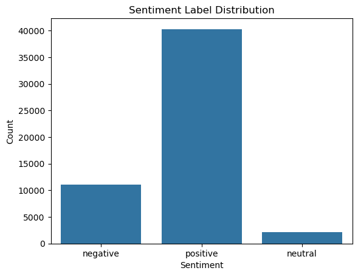

# Pesa-Salama-Classifier
## Real-time Financial Complaint Monitor and Distress Index for Kenya’s Mobile Money Ecosystem

An end-to-end NLP pipeline that collects, cleans, and classifies customer reviews from Kenya's top fintech apps, combining classical machine learning with a multilingual transformer (AfriBERTa) to power a real-time financial complaint monitoring system.

---

## Project Overview

Kenya's mobile money and digital banking ecosystem processes millions of user transactions daily. Buried in Google Play Store reviews lies a rich, real-time signal of customer frustration edident through failed transactions, fraud complaints, hidden charges, and broken UX. These are expressed in written English, Swahili, and Sheng languages.

This project builds an automated pipeline to:

- Scrape raw, multilingual reviews from six major Kenyan fintech apps
- Preprocess and clean code-switched (English/Swahili/Sheng) text
- Classify reviews by sentiment (positive / neutral / negative)
- Detect complaint categories (fraud, failed transaction, hidden charges, customer support)
- Explain model predictions using SHAP
- Fine-tune AfriBERTa, a pretrained African-language transformer, for advanced classification

The end goal is a deployable monitoring system that flags emerging complaint trends in real time.

---
- **Primary Domain:** Financial Technology (FinTech) — Mobile Money & Digital Lending
- **Secondary Domain:** Natural Language Processing (NLP)
- **Geographic Focus:** Kenya
- **Regulatory Context:** Central Bank of Kenya (CBK)

## Dataset

| Property | Detail |
|---|---|
| **Source** | Google Play Store — Kenya country store (`country='ke'`) |
| **Collection method** | `google-play-scraper` Python library (no API key required) |
| **Raw records** | 53,500 reviews |
| **Date range** | 2023 – April 2026 |
| **Languages** | English, Swahili, Sheng (code-switched) |

### Apps Scraped

| App | Play Store ID | Category |
|---|---|---|
| M-PESA | `com.safaricom.mpesa.lifestyle` | Core mobile money |
| MySafaricom | `com.safaricom.mysafaricom` | Account management |
| KCB Mobile | `com.kcb.mobilebanking.android.mbp` | Traditional bank |
| Equity Mobile | `ke.co.equitygroup.equitymobile` | Traditional bank |
| Tala | `com.inventureaccess.safarirahisi` | Digital micro-lending |
| Branch | `com.branch_international.branch.branch_demo_android` | Digital micro-lending |

### Key Columns (cleaned dataset)

| Column | Description |
|---|---|
| `content` | Original review text |
| `score` | Star rating (1–5) |
| `sentiment` / `sentiment_label` | Positive / Neutral / Negative |
| `complaint_label` | Complaint category (keyword-classified) |
| `fraud_indicator` | Boolean flag for fraud-related language |
| `cleaned_text` | Normalised, emoji-decoded text |
| `processed_text` | Fully preprocessed text ready for TF-IDF |
| `final_language` | Detected language (en / sw / mixed) |
| `app_name` | Source application |

#### Target Variables

- Primary:`sentiment_label` — Positive / Neutral / Negative  
- Secondary: `complaint_type` — Fraud / Service Failure / Loan / General
---

 **Convention:** `MASTER_RAW_kenya_fintech.csv` is the permanent, untouched source of truth. All transformations are applied to copies in the preprocessing notebook.

 ##  Pipeline Walkthrough

Key Features

- Multilingual NLP — handles English, Swahili, and Sheng (code-switched Kenyan slang)
- Sentiment Classification — negative / neutral / positive labels derived from star ratings and text
- Complaint Categorisation — keyword-based classification into fraud complaints, failed transactions, hidden charges, and customer support issues
- Fraud Indicator Detection — binary fraud flag derived from review content
- Financial Distress Index — composite monthly risk score per app combining four normalized signals
- Complaint Forecasting — 6-month ahead forecasts for overall complaints, fraud complaints, and per-app volumes
- Tableau Dashboard — interactive visualization of all analytical outputs
- Strategic Recommendations — app-specific and sector-wide improvement suggestions
---

## Tech Stack

| Layer | Tools / Libraries |
|-------|------------------|
| Data Processing | `pandas`, `numpy` |
| NLP & Text Cleaning | `re`, `gensim`, `transformers`, `sentencepiece` |
| Topic Modelling | `gensim` (LDA) |
| Transformer Model | `AfriBERTa` (`castorini/afriberta_base`) via HuggingFace |
| ML Training | `PyTorch`, HuggingFace `Trainer` API |
| Forecasting | `prophet` (Facebook Prophet) |
| Evaluation | `scikit-learn` (`classification_report`, `f1_score`, confusion matrix) |
| Visualisation | `matplotlib`, `seaborn` |
| Scaling | `sklearn.preprocessing.MinMaxScaler` |
| Dashboard | Tableau Public |
| Environment | Google Colab (GPU), Python 3 |


### Data Extraction 
Reviews are scraped from the Kenya Google Play Store using `google-play-scraper`. Up to 10,000 reviews are collected per app (sorted by newest), then concatenated into a single master CSV.

- **Total reviews collected:** ~53,500 across 6 apps
- **Date range:** 2023 – April 2026
- **Languages:** English, Swahili, Sheng (code-switched)
- **Raw file is never modified after saving**

### Exploratory Data Analysis
Distribution of ratings, review volumes per app, temporal trends, language detection, and emoji usage are examined to guide preprocessing and modelling decisions.

- Review count per app


- star-rating distributions


-  Time trend for number of riviews

### Data Preprocessing
A multi-step NLP pipeline cleans and prepares the text:

- Removal of empty reviews, unnecessary columns, and duplicate IDs
- Emoji conversion to text descriptions
- Language detection (`lingua`) and Sheng identification
- Text normalisation — lowercasing, punctuation removal, URL stripping
- Tokenisation, stopword removal, stemming, and lemmatisation
- Feature engineering: `sentiment_label`, `complaint_label`, `fraud_indicator`, `review_length`, `word_count`
## Modelling
### LDA Topic Modelling
Latent Dirichlet Allocation is applied to negative reviews only to surface hidden complaint themes:

| Topic | Label |
|-------|-------|
| 0 | Fraud Complaint |
| 1 | Failed Transaction |
| 2 | Hidden Charges |
| 3 | Customer Support |


- Because Kenyan users pack multiple complaints into short, emotionally charged reviews, LDA topics overlap significantly. A keyword classifier (`complaint_label`) becomes more reliable for downstream modelling.

**Finding:** Significant topic overlap was observed, consistent with short, emotionally charged Kenyan fintech reviews that combine multiple complaints in a single sentence. A keyword-based complaint classifier was found to be more reliable than LDA alone for this dataset, and is used as the primary complaint feature downstream.

### Classical ML Modelling

Three models trained on TF-IDF features, evaluated with weighted F1-score:

- **Logistic Regression** (baseline)
- **XGBoost** (default settings)
- **XGBoost** (hyperparameter-tuned via `RandomizedSearchCV`, 30 iterations, 5-fold stratified CV)

SHAP `TreeExplainer` is used to explain individual predictions and creates the most influential tokens per sentiment class.

#### Key SHAP Insights

| Negative drivers | Positive drivers |
|---|---|
| `worst`, `useless`, `terrible`, `slow`, `crashing`, `login` | `excellent`, `best`, `great`, `awesome`, `efficient`, `reliable` |

### AfriBERTa Transformer Model
A multilingual transformer model fine-tuned on African languages is adapted for the Kenya fintech context. AfriBERTa handles code-switched Swahili/Sheng/English text that traditional models underperform on.

Fine-tuned `castorini/afriberta_base` for three-class sentiment classification.

| Label | Score Mapping |
|-------|--------------|
| Negative (0) | Score ≤ 2 |
| Neutral (1) | Score = 3 |
| Positive (2) | Score ≥ 4 |


- The dataset shows class imbalance, with positive sentiments having the highest number of reviews compared to negative and average sentiments. 

- **Base model:** `castorini/afriberta_large`
- **Framework:** HuggingFace Transformers + PyTorch
- **Evaluation:** Weighted F1, classification report, confusion matrix
- **Training environment:** Google Colab (GPU-accelerated)

#### Modelling Results
TF-IDF vectorisation feeds three classifiers for **sentiment classification** (negative / neutral / positive):

| Model | Weighted F1 | Precision | Recall | CV F1 (5-fold) |
|-------|------------|-----------|--------|----------------|
| Logistic Regression (Baseline) | 0.828 | 0.855 | 0.805 | 0.826 |
| XGBoost Intermediate | 0.818 | 0.810 | 0.847 | 0.816 |
| **XGBoost Advanced (Tuned)** | **0.848** | **0.837** | **0.869** | **0.849** |

- Recommended production model: XGBoost Advanced (Tuned)

## Financial Distress Index
The FDI is a composite monthly risk score that quantifies systemic financial and operational stress across Kenya's mobile money ecosystem.

- The four normalised indicators:

| Indicator | Description |
|-----------|-------------|
| **Complaint Pressure** | Monthly complaint rate |
| **Rating Stress** | Deviation from maximum rating |
| **Trend Acceleration** | Complaint growth vs rolling average |
| **Shock Intensity** | Z-score standardised anomaly signal |


The FDI is scaled 0–1 and classified into four distress levels:

- 🟢 **Green** — Normal operations
- 🟡 **Yellow** — Elevated stress, monitor closely
- 🟠 **Orange** — High distress, action recommended
- 🔴 **Red** — Critical — systemic risk detected

Aanalysis of the velocity and direction of financial distress trends over time.

The Financial Distress Index provides a practical approach for detecting risk patterns early and supporting data-driven decision-making.

---

## Forecasting
Facebook Prophet is used for 6-month ahead forecasting of monthly complaint volumes.

### Forecasts Generated

| Forecast | Target |
|----------|--------|
| Overall Negative Complaints | All apps — negative sentiment reviews |
| Fraud Complaint Spikes | Reviews with `fraud_indicator == 1` |
| M-Pesa Complaints | M-Pesa app reviews |
| Tala Complaints | Tala app reviews |

**Key Finding:** Complaint volume shows an upward trend over time, with periodic fraud complaint spikes. This suggests that fintech user dissatisfaction and financial distress may continue to rise if service issues are not proactively addressed.

## Deployment

| Component | Detail |
|-----------|--------|
| Framework | Streamlit |
| Model | XGBoost + TF-IDF (`advancedxgboostmodelfinal.pkl`) |
| Python version | 3.12 (pinned via `python-version`) |
| History storage | `pesa_salama_history.json` (persistent local JSON) |
| Settings storage | `pesa_salama_settings.json` |
| Hosting | Streamlit Community Cloud |

### Application Functionality

**Single Review Analysis**
- Text input accepting English, Swahili, and Sheng
- Predicted sentiment: Positive / Neutral / Negative
- Confidence score with visual progress bar
- Class probability breakdown across all three labels
- Complaint category detection (Network Issues, Transaction Issues, Customer Service, App Issues, General Feedback)
- Language detection: English / Swahili / Sheng / Auto-detect
- Urgent flag when a negative review touches a critical category (Transaction Issues or App Issues)
- Low-confidence flag when score falls below a configurable threshold
- Per-result JSON export

**Batch CSV Analysis**
- Upload a CSV file with a `review` column
- Runs all reviews through the full prediction pipeline with a progress bar
- Results appended to persistent history
- Batch alert triggered when negative review percentage exceeds a configurable threshold

**History, Filtering & Insights**
- Date filters: Today / This Week / This Month / All Time / Custom range
- Source filter: manual vs CSV Upload
- Summary bar: total, positive, neutral, negative, urgent count, average confidence
- Charts: sentiment pie, complaint category bar, per-review confidence histogram, daily trend bar
- Recent 10 reviews displayed inline; full history downloadable as CSV

**User Feedback Loop**
- After each prediction, the user can mark it as Correct / Incorrect / Unsure
- Feedback is saved to history for model improvement tracking

**Alert System**
- Email alerts via Gmail SMTP (configurable sender, app password, recipient)
- Slack alerts via Incoming Webhook URL
- Alert triggers: urgent negative reviews, low-confidence results, batch negative % exceeded
- Test alert button for configuration validation

### Negation Handling

The app applies a pre-processing negation handler before TF-IDF vectorization, covering common English and Swahili patterns:

| Pattern | Mapped to |
|---------|-----------|
| `not good`, `not working`, `not helpful` | `negative` |
| `hakuna network`, `haifanyi vizuri`, `si nzuri` | `negative` |
| `mbaya`, `mbovu` | `negative` |
| `not_<word>` (general) | negated token |
---

## Dashboard

The master Tableau dataset is produced by merging raw reviews with all NLP outputs and computing a per-app monthly distress score.

Distress Score = ((Fraud Rate × 0.6) + (Negative Rate × 0.4)) × 10

[**View Interactive Tableau Dashboard →**](https://public.tableau.com/views/pesasalama/Dashboard?:language=en-US&publish=yes&:sid=&:redirect=auth&:display_count=n&:origin=viz_share_link)

---

## Business Insights & Recommendations

### Key Findings

- Negative customer sentiment accounts for a significant share of fintech reviews, driven by transaction failures, fraud concerns, and poor customer support.
- Fraud complaint rates vary substantially across apps, with some platforms showing materially higher rates indicative of weaker fraud prevention systems.
- Higher financial distress scores correlate with operational instability and declining customer trust.
- Persistent negative sentiment damages customer retention and platform reputation within Kenya's competitive fintech ecosystem.
- Minority Complaint Categories Are Often Overlooked
- Customer Feedback Can Serve as a Real-Time Financial Distress Signal

**Adopt Pesa Salama as an Early-Warning System**

- Use real-time complaint monitoring and the Financial Distress Index (FDI) to identify emerging risks before they escalate into major service disruptions, fraud incidents, or reputational crisis.

**Prioritize Service Reliability Improvements**

-Focus on reducing transaction failures, app crashes, login issues, and OTP delivery delays, which account for a large share of customer dissatisfaction and operational friction.

**Strengthen Fraud Detection and Consumer Protection**

- Integrate complaint-based fraud signals into operational workflows to enable faster investigation, response, and customer protection measures.

**Establish Data-Driven Regulatory Oversight**

- Leverage ecosystem-wide monitoring dashboards to support proactive supervision, evidence-based interventions, and improved accountability across fintech providers.

### Sector-Wide Recommendations


---

## Installation & Setup

### Prerequisites

- Python 3.8+
- Google Colab (recommended for AfriBERTa GPU training)
- HuggingFace account (for model access)
- Tableau Public (for dashboard)

## Clone & Install

- git clone https://github.com/Marian-amo/Pesa-Salama-Classifier.git
- cd Pesa-Salama-Classifier
- python -m venv venv && source venv/bin/activate  # Windows: venv\Scripts\activate
- pip install -r requirements.txt

### Install Dependencies

```bash
pip install pandas numpy matplotlib seaborn scikit-learn gensim prophet
pip install transformers datasets sentencepiece accelerate evaluate
pip install torch xgboost shap streamlit
pip install google-play-scraper
Download NLTK data (run once in Python):
```python
import nltk
nltk.download('punkt')
nltk.download('stopwords')
nltk.download('wordnet')
```
## Data

The raw dataset is at `data/MASTER_RAW_kenya_fintech.csv` (~53,500 reviews, 6 apps, 2023–2026).

> ⚠️ Do not modify this file. All transformations must be applied to copies.

To re-scrape fresh data instead, run **Notebook 01** (internet connection required). Skip it to use the provided CSV.

---
## Run the Notebooks (in order)

| # | Notebook | Input | Output |
|---|----------|-------|--------|
| 01 | `data_extraction` | Google Play Store | `MASTER_RAW_kenya_fintech.csv` |
| 02 | `exploratory_data_analysis` | raw CSV | visualisations only |
| 03 | `data_preprocessing` | raw CSV | `cleaned_data.csv` |
| 04 | `LDA_modelling` | `cleaned_data.csv` | topic visualisations |
| 05 | `modelling` | `cleaned_data.csv` | `models/*.pkl`, `model_evaluation_results.csv` |
| 06 | `AfriBerta_model`  Colab | `cleaned_data.csv` | fine-tuned model |
| 07 | `financial_distress_index` | `cleaned_data.csv` | `monthly_summary.csv` |
| 08–09 | `forecasting` | `monthly_summary.csv` | forecast plots |
| 10 | `tableau_dataset_preparation` | all outputs | `pesa_salama_MASTER_tableau.csv` |
| 11 | `business_insights` | all outputs | report only |

### Notebook 06 — Google Colab (GPU)
1. Go to [colab.research.google.com](https://colab.research.google.com)
2. Upload `06_AfriBerta_model.ipynb`
3. Upload `cleaned_data.csv` to session storage or mount Google Drive
4. Set runtime: **Runtime > Change runtime type > GPU**
5. Run all cells

---
## Run the Streamlit App

```bash
cd app
streamlit run app.py
```
Opens at `https://streamlit.io/`. Requires `advancedxgboostmodelfinal.pkl` to be present in `app/`.

---

## Tableau Dashboard

Live dashboard: [View on Tableau Public](https://public.tableau.com/views/pesasalama/Dashboard)

To rebuild locally: run Notebook 09, then connect `pesa_salama_MASTER_tableau.csv` in Tableau Public.

---
```
## Python Libraries

| Purpose | Libraries |
|---------|-----------|
| Data Collection | `google-play-scraper` |
| Data Processing | `pandas`, `numpy`, `nltk`, `re` |
| Visualisation | `matplotlib`, `seaborn`, `wordcloud` |
| NLP | `scikit-learn`, `gensim` |
| Modelling | `xgboost`, `transformers`, `torch` |
| Explainability | `shap` |
| Forecasting | `prophet` |
| Scaling | `sklearn.preprocessing.MinMaxScaler` |
| Deployment | `streamlit` |
| Dashboard | Tableau Public |


## 15.Project Structure

```
Pesa-Salama-Classifier/
│
├── README.md
├── requirements.txt
│
├── app/                                   # Streamlit deployment
│   ├── app.py                             # Main Streamlit application (v2.0)
│   ├── advancedxgboostmodelfinal.pkl      # Production model (XGBoost + TF-IDF)
│   ├── pesa_salama_history.json           # Persistent review history (JSON)
│   └── python-version                     # Python version pin (3.12)
│
├── images/                                # EDA & analysis visuals
│   ├── Financial_Distress.png
│   ├── image.png
│   ├── Review_count_per_app.png
│   ├── sentiment_distrubution.png
│   ├── Time_trend.png
│   ├── star-rating_distributions.png
│   └── Top_Words_per_Topic.png
│
├── models/                                # Serialized model artefacts
│   ├── baselinelog_pipeline.pkl           # TF-IDF + Logistic Regression
│   ├── intermediatead_pipeline.pkl        # TF-IDF + XGBoost (intermediate)
│   └── advancedxgbmodel.pkl              # Advanced XGBoost model & SMOTE
│
└── notebooks/                             # Analysis pipeline (run in order)
    ├── 01.data_extraction.ipynb
    ├── 02.exploratory_data_analysis.ipynb
    ├── 03.data_preprocessing.ipynb
    ├── 04.LDA modelling.ipynb
    ├── 05.modelling.ipynb
    ├── 06_AfriBerta_model.ipynb           # Run on Google Colab (GPU)
    ├── 07.financial_distress_index_analysis.ipynb
    ├── 08.forcasting.ipynb
    ├── 09.forcasting.ipynb
    ├── 10.tableau_dataset_preparation.ipynb
    ├── 11.business_insights_and_recommendations.ipynb
└── data/
    ├── MASTER_RAW_kenya_fintech.csv       # Raw scraped reviews
    ├── cleaned_data.csv                   # NLP-enhanced cleaned dataset
    ├── monthly_summary.csv                # Aggregated monthly metrics
    ├── model_evaluation_results.csv       # Model comparison results
    └── pesa_salama_MASTER_tableau.csv     # Final Tableau-ready dataset

## 16.Troubleshooting

| Issue | Fix |
|-------|-----|
| Missing module | Activate venv, re-run `pip install -r requirements.txt` |
| Prophet install fails | `pip install prophet --no-build-isolation` |
| Notebook 06 is slow | Run on Colab with GPU — do not run on CPU |
| Streamlit model not found | Confirm `advancedxgboostmodelfinal.pkl` is in `app/` |
| NLTK resource error | Run the `nltk.download()` commands in Section Install & Dependencies|
